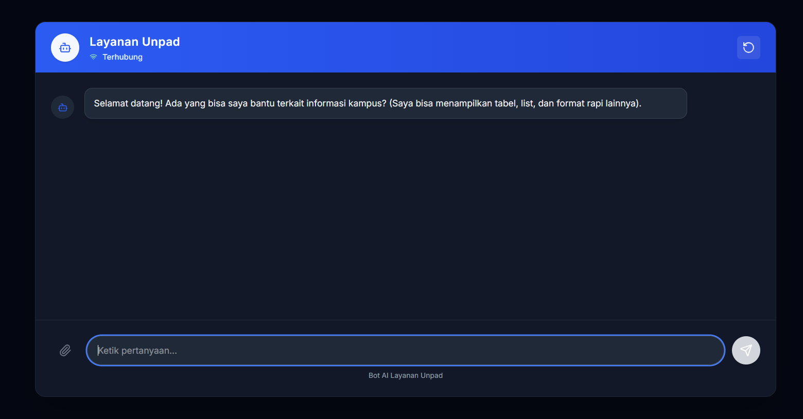
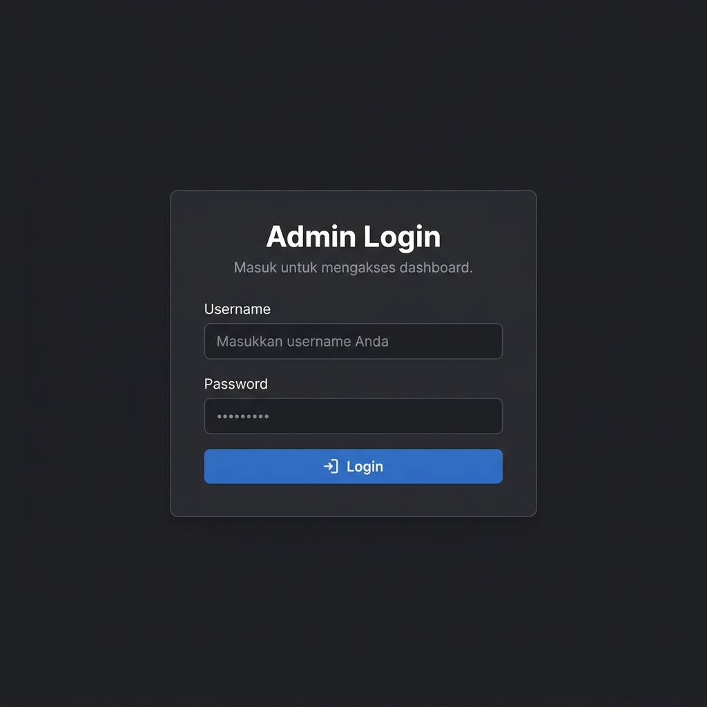
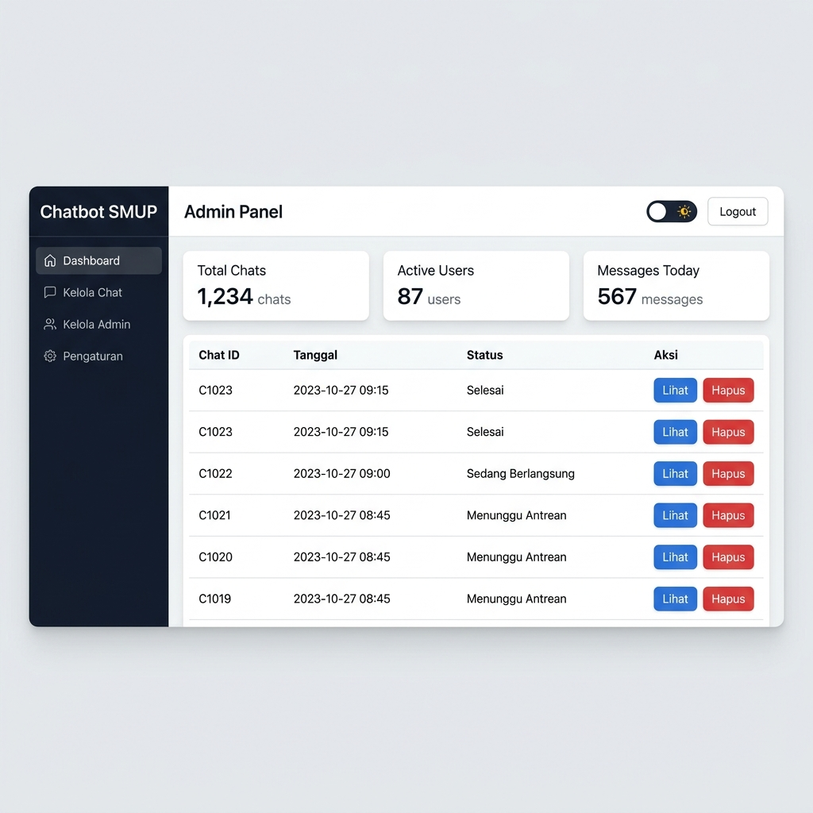

# chatbot-SMUP

Chatbot SMUP adalah sistem chatbot berbasis web yang dirancang untuk membantu calon mahasiswa memahami informasi terkait Seleksi Masuk Universitas Padjadjaran (SMUP).

---

## 🛠️ Tech Stack

| Layer | Teknologi |
|---|---|
| Front-end | Next.js 15 (React 19, TypeScript) |
| Back-end API | Node.js + Express |
| Chatbot Service | Python (FastAPI + WebSocket) |
| Database | MongoDB (lokal) |
| AI/LLM | Groq API + Google Generative AI |

---

## ✅ Prasyarat

Pastikan sudah terinstal di komputer:

- [Node.js](https://nodejs.org/) v18+
- [Python](https://www.python.org/) 3.10+
- [MongoDB](https://www.mongodb.com/try/download/community) (running secara lokal di port `27017`)
- `pip` untuk install dependensi Python

---

## ⚙️ Konfigurasi Environment

### 1. Back-end Node.js (`back-end/.env`)

Buat file `.env` di folder `back-end/` (atau sesuaikan yang sudah ada):

```env
GROQ_API_KEY=your_groq_api_key_here
MONGO_URI=mongodb://localhost:27017/newSMUP
STORAGE_PATH=public/upload
SESSION_SECRET=ganti_dengan_nilai_aman
MAX_ATTACHMENT_SIZE=10485760
RATE_LIMIT_MAX=10
RATE_LIMIT_WINDOW=60
BASE_FILE_URL=http://localhost:3067
PORT=5000
```

### 2. Python Service (`back-end/new_service_ws/.env`)

Buat file `.env` di folder `back-end/new_service_ws/` (atau sesuaikan yang sudah ada):

```env
GROQ_API_KEY=your_groq_api_key_here
MONGO_URI=mongodb://localhost:27017/newSMUP
STORAGE_PATH=public/upload
WS_HOST=0.0.0.0
WS_PORT=8765
CHAT_TIMEOUT_MS=3000
SESSION_SECRET=ganti_dengan_nilai_aman
MAX_ATTACHMENT_SIZE=10485760
RATE_LIMIT_MAX=10
RATE_LIMIT_WINDOW=60
BASE_FILE_URL=http://localhost:3067
PORT=3067
```

> **Catatan:** Dapatkan `GROQ_API_KEY` dari [https://console.groq.com](https://console.groq.com)

---

## 🚀 Cara Menjalankan

Proyek ini terdiri dari **4 service** yang perlu dijalankan secara bersamaan. Buka **4 terminal terpisah**.

### Terminal 1 — Front-end (Next.js)

```bash
cd front-end
npm install
npm run dev
```

> Berjalan di: **http://localhost:3000**

---

### Terminal 2 — Back-end API (Node.js / Express)

```bash
cd back-end
npm install
node server.js
```

> Berjalan di: **http://localhost:5000**

---

### Terminal 3 — WebSocket Server (Python)

```bash
cd back-end/new_service_ws
pip install -r requirements.txt
python server.py
```

> Berjalan di WebSocket: **ws://localhost:8765**

---

### Terminal 4 — Static/API Server (Python FastAPI)

```bash
cd back-end/new_service_ws
python static_server.py
```

> Berjalan di: **http://localhost:3067**

---

## 🌐 Port Summary

| Service | Port | Protokol |
|---|---|---|
| Front-end (Next.js) | `3000` | HTTP |
| Back-end API (Node.js) | `5000` | HTTP |
| WebSocket Server (Python) | `8765` | WebSocket |
| FastAPI Server (Python) | `3067` | HTTP |
| MongoDB | `27017` | TCP |

---

## 🔐 Setup Akun Admin Pertama

Karena sistem menggunakan autentikasi berbasis session, Anda perlu membuat akun admin pertama secara manual melalui MongoDB.

Buat file `seed.js` di dalam folder `back-end/` dengan isi berikut:

```js
require('dotenv').config();
const mongoose = require('mongoose');
const bcrypt = require('bcrypt');
const { Admin } = require('./models/adminModel');

async function main() {
  await mongoose.connect(process.env.MONGO_URI);
  const salt = await bcrypt.genSalt(10);
  const hash = await bcrypt.hash('password_anda', salt);
  await new Admin({ username: 'admin', password: hash, role: 'SUPER_ADMIN' }).save();
  console.log('Admin berhasil dibuat!');
  await mongoose.disconnect();
}
main().catch(console.error);
```

Lalu jalankan:
```bash
cd back-end
node seed.js
```

---

## 🖼️ Galeri Antarmuka Pengguna

Berikut adalah tampilan antarmuka dari setiap bagian sistem Chatbot SMUP.

---

### 1. 🤖 Halaman Chatbot (Beranda)

Halaman utama yang dapat diakses oleh calon mahasiswa di **http://localhost:3000**. Pengguna dapat langsung bertanya mengenai informasi SMUP (jalur masuk, syarat, jadwal, dll.) melalui chat. Mendukung pengiriman pesan teks dan lampiran file (gambar/PDF).



**Cara Penggunaan:**
- Ketik pertanyaan di kolom chat, lalu tekan **Enter** atau klik tombol kirim
- Lampirkan file (gambar/PDF) menggunakan ikon 📎 untuk pertanyaan tentang dokumen
- Riwayat percakapan tersimpan otomatis dan bisa diakses kembali dari sidebar

---

### 2. 🔑 Halaman Login Admin

Halaman login untuk administrator sistem di **http://localhost:3000/login**. Hanya pengguna yang terdaftar di database yang dapat masuk.



**Cara Penggunaan:**
- Masukkan **Username** dan **Password** admin yang telah dibuat
- Klik tombol **Login** untuk masuk ke dashboard
- Jika login berhasil, Anda akan diarahkan ke halaman Admin Dashboard
- Akun default (jika sudah di-seed): `admin` / `4dm1n5MUP`

---

### 3. 📊 Dashboard Admin

Halaman utama admin di **http://localhost:3000/Admin** setelah berhasil login. Admin dapat memantau dan mengelola seluruh percakapan chatbot yang masuk.



**Fitur yang tersedia:**
- **Lihat semua chat** — daftar semua sesi percakapan pengguna
- **Lihat riwayat pesan** — klik pada chat untuk melihat isi percakapan lengkap
- **Hapus chat** — hapus sesi percakapan yang tidak diperlukan
- **Hapus chat lama** — bersihkan semua chat yang sudah tua sekaligus
- **Mode terang/gelap** — toggle tema tampilan

---

## 📁 Struktur Folder

```
smup-unpad/
├── front-end/          # Aplikasi Next.js (UI chatbot & admin)
│   └── src/
│       ├── app/
│       │   ├── chatbot/        # Halaman chatbot utama
│       │   ├── Admin/          # Halaman admin dashboard
│       │   └── login/          # Halaman login admin
│       └── utils/
├── back-end/           # Server-side
│   ├── server.js       # Express API server
│   ├── routes/         # Routing Express
│   ├── controller/     # Controller logic
│   ├── models/         # Mongoose models
│   └── new_service_ws/ # Python service
│       ├── server.py          # WebSocket server (chatbot realtime)
│       ├── static_server.py   # FastAPI server (file & RAG API)
│       ├── rag/               # Modul RAG (Retrieval-Augmented Generation)
│       └── scrapping/         # Modul web scraping
└── docs/
    └── images/         # Screenshot antarmuka pengguna
```
